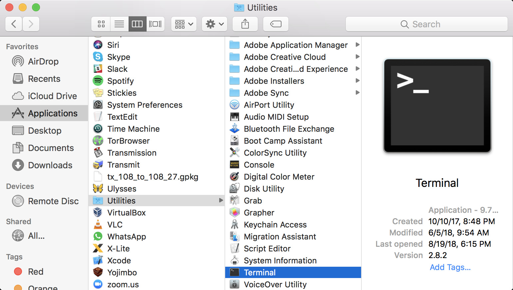
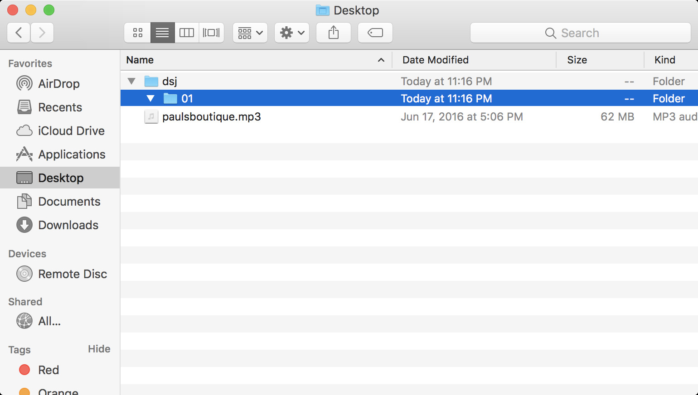

# Tutorial: Command line

By [Dan Phiffer](https://phiffer.org/)

## Preamble

This tutorial assumes you are using macOS. If you are _not_ using macOS, you may need to adjust some of the details. Linux behaves very similarly to macOS, but Windows less so. If you are already comfortable using the command line, you may want to check out the [Further reading](#further-reading) section at the end of this tutorial.

## Hello, Terminal

* In the Finder, go to __Applications → Utilities__ and double-click on __Terminal.app__.

_A window will open where you can type things._ Some commands are substitutes for things you can do with a graphical user interface (GUI), but other commands have no equivalent. The command-line is where software development happens. You type a command, press enter, and the computer responds with a result.



## Where am I?

* Type `pwd` (then press enter).

```
$ pwd
/Users/danphiffer
```

(Instead of _danphiffer_ you should see your own username.)

The `$` sign is a common notation for the _prompt_, an invitation to type in a command. The prompt may not always look like a `$`, but that's the symbol that gets used in lots of documentation as the default prompt.

The `pwd` command responds with your "working directory," which is _where_ your commands are executed. By default your terminal session starts out in your home directory (in macOS, that's located in Users → _username_).

## What is here?

* Type `ls`.

The `ls` command _lists_ the files and folders in the current working directory.

```
$ ls
Desktop         Downloads       Movies          Pictures
Documents       Library         Music           Public
```

## Moving around

* Type `cd Desktop` to move to the Desktop.
* Double-check you have moved by typing `pwd`.
* Type `ls -l` to see what files are here.

```
$ cd Desktop
$ pwd
/Users/danphiffer/Desktop
$ ls -l
total 123008
-rw-r--r--  1 danphiffer  staff  61965791 Jun 17  2016 paulsboutique.mp3
```

The `cd` command changes our working directory. When we type `cd Desktop` the `Desktop` part is called an _argument_.

The `-l` argument for the `ls` command makes the listing include more details, including file permissions, file size (in bytes) and last modified information.

## Making folders

Let's create a folder that we can use to save our work.

```
$ mkdir -p dsj/01
```

The command `mkdir` is like what it sounds like, it _makes_ a _directory_. The `-p` argument is an option to create any intermediate subdirectories as necessary, so both `dsj` and `01` get created.

## Paths can be tricky

The paths we use for files can be kind of tricky, and there are lots of shortcuts you can use to refer to files located in different places.

* `.` is the current working directory
* `..` is the directory _above_ the current directory (the one that contains it)
* `~` is a shortcut to your home directory
* when a path starts with `/` it is called an _absolute_ path, otherwise it is _relative_ to the current working directory

These are all ways of writing paths to the same folder (relative to the Desktop):

* `dsj/01`
* `./dsj/01`
* `../Desktop/dsj/01`
* `~/Desktop/dsj/01`
* `/Users/danphiffer/Desktop/dsj/01`

## Sneaky hidden files

Next, change directory into the new `01` folder and list the contents with `ls -la`.

```
$ cd dsj/01
$ ls -la
total 0
drwxr-xr-x  2 danphiffer  staff  64 Aug 19 17:16 .
drwxr-xr-x  3 danphiffer  staff  96 Aug 19 17:16 ..
```

When we include the `-la` argument, it shows _all_ of the files including the current folder (`.`) and its parent (`..`).

Let's make a new folder `.secret` that will get hidden by default. You can try listing with regular `ls` and then again with `ls -a`.

```
$ mkdir .secret
$ ls
$ ls -a
.       ..      .secret
```

Any file or folder that starts with `.` gets omitted by `ls` (unless you provide `-a`) and gets hidden by default in the Finder (you can configure it to show all files).

Because you only included `-a` instead of `-la` the results were listed in the default summary format.

## Apple-y things

The `open` command is the equivalent to double-clicking on things in macOS.

* Type `open .` to open the current working directory (`dsj/01`, on your Desktop).

You should see an empty folder (`.secret` is hidden because its name starts with `.`).

* Now type `open .secret` to open up the hidden folder.



Hidden folders are not really all that private so you shouldn't count on them to hide anything important. But you may discover interesting configuration _dot files_ in your home directory you didn't know were there.

## Shortcuts

There are keyboard shortcuts that can save you lots of time when you're working in the terminal.

* Without pressing enter, type: `open .s` and then press the tab key.

The terminal recognized that you want to open something that starts with `.s` and then fills in the rest.

* Press the up arrow key to see the last command you entered.
* Press the up/down arrow keys repeatedly to look through earlier commands.
* Enter `history` to look through all of the commands you've typed.

## Create a file

Next, we will create a new file `test.txt` in the `01` folder.

* Type `nano test.txt` to create a new file called `test.txt`.

The text editor will let you write and save a text document, kind of like a pared-down version of Microsoft Word.

When you are ready to save your changes, press __ctrl-O__ (that's _ctrl_ not _cmd_, and the letter "o" not a "zero") to _write out_ the file to disk. You will be prompted for the file location, and it's fine to accept the default by pressing enter.

When you are ready to close nano, press __ctrl-X__.

## Read the file

You can view the contents of your file with the `cat` command. 😸

* Type `cat test.txt` to see the contents of the file.

"Ok," you might be asking, "but what if you want to read the contents of a _very long file?_". You can check just the beginning or just the end of the file, or you can search for matches in the middle.

* `head mobydick.txt` can be used to get the beginning part of a file.
* `tail donquixote.txt` shows the end of a file. `tail -f output.log` will continuously show the end of a log file as it gets written to.
* `more frankenstein.txt` will let you browse through the contents of a long file in small increments.
* `grep morlock timemachine.txt` will show all the lines in `timemachine.txt` that contain the word `morlock`.


## Update the file

You can continue editing the file with `nano test.txt`.

## Delete the file

To delete the file: `rm test.txt`.

## If you get stuck

* You can make a new tab in the terminal by pressing __cmd-T__.
* Force a running command to cancel by pressing __ctrl-C__.
* Suspend a command to the background by pressing __ctrl-Z__ (and then resume it by entering `fg`, bringing it back to the _foreground_).
* You can always ask for help! Send me email: [danphiffer@bennington.edu](mailto:danphiffer@bennington.edu)

## Further reading

* [UNIX text processing tools](http://rwet.decontextualize.com/book/unix/) by Allison Parrish
* [Terminal Cheatsheet for Mac](https://github.com/0nn0/terminal-mac-cheatsheet) by Onno Schwanen
* [In the Beginning... Was the Command Line](http://web.archive.org/web/20180218045352/http://www.cryptonomicon.com/beginning.html) by Neal Stephenson
