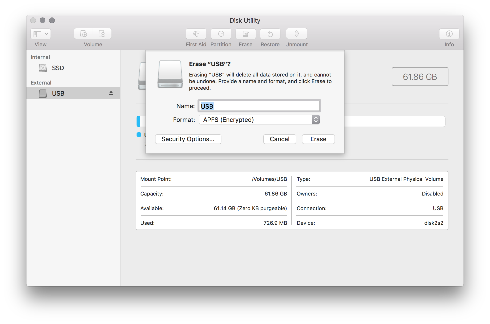
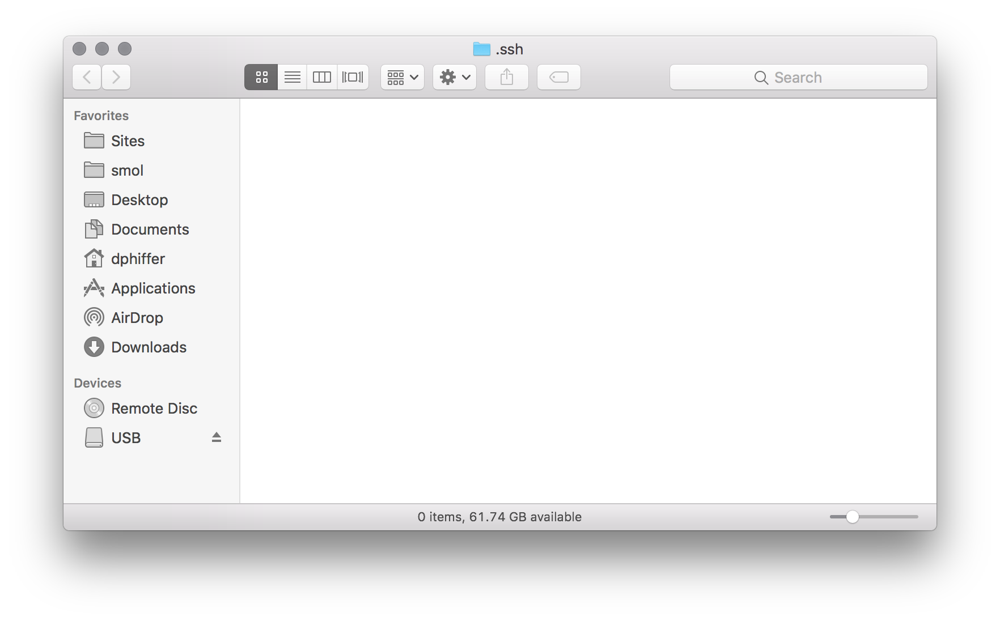
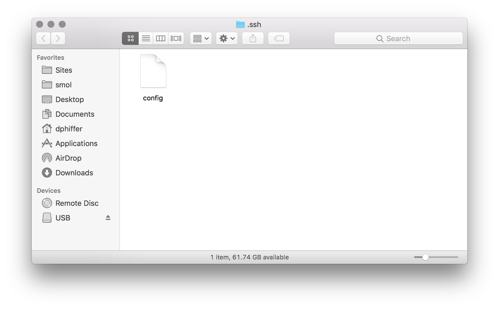

# Tutorial: ssh + scp + rsync

By [Dan Phiffer](https://phiffer.org/)

This tutorial offers an introduction to the Swiss army knife of networked computing: `ssh`. We'll start by generating a public/private key pair, then use them to login to a remote server. We will also cover `ssh`'s cousins `scp` and `rsync` which use an `ssh` connection to transfer files.

We're building on skills from the [command line tutorial](01-command-line.md) and we will be assuming that you have a USB thumb drive to store files onto.

## Format your USB thumb drive

If you have a portable hard drive you want to use instead of a USB thumb drive, feel free to skip this section. Before you do, be sure to rename the drive `USB`. This is important for making sure all the configuration paths will work.

If you have any files on your USB thumb drive, copy them to another drive. We are going to reformat the disk to an __APFS (Encrypted)__ volume.

* In the Finder, go to __Applications → Utilities__ and double-click on __Disk Utility.app__.
* Select your thumb drive and double-check you have the right one selected, you really don't want to erase the wrong one.
* Click the __Erase__ button.
* Enter a `USB` as the name for your drive.
* Choose the Format as __APFS (Encrypted)__.
* Enter a password for your drive. Choose a password you will remember and make a note of it somewhere.
* Press the __Erase__ button.



Now you should have a new disk mounted with the name `USB`.

## Generate your SSH key pair

Next we will generate an SSH key pair. This is kind of like a password that's stored on your disk as a pair of two files.

* The __public key__ is called a key but it is really more a personal lock that you can send to other people safely.
* The __private key__ is something you keep secret, it is the key to your lock and you should never share it with anyone.

Let's start by opening up the Terminal.

* In the Finder, go to __Applications → Utilities__ and double-click on __Terminal.app__.
* Change directory to your newly formatted USB thumb drive

```
$ cd /Volumes/USB
```

That command should work whether you have a USB thumb drive or another kind of external drive called `USB`.

Let's make a new folder for your SSH keys.

```
$ mkdir ssh
$ cd ssh
```

Now we can generate our new keys.

```
$ ssh-keygen
```

* You will be asked to provide a name, you should enter: `./organizer.network` (the `./` part means "put this file in the current folder.")
* When prompted for a password, just press enter (no password protection).
* Press enter again to confirm you don't want a password.

You should see something like the following:

```
$ ssh-keygen
Generating public/private rsa key pair.
Enter file in which to save the key (/Users/dphiffer/.ssh/id_rsa): ./organizer.network
Enter passphrase (empty for no passphrase):
Enter same passphrase again:
Your identification has been saved in ./organizer.network.
Your public key has been saved in ./organizer.network.pub.
```

The output will also include some extra information about your key's fingerprint.

* Your _private key_ that you should __never share__, is the file `organizer.network`
* Your _public key_ that is __okay to share__ is the file `oragnizer.network.pub`

## Email your public key

In order for you to get access to the server we're using in the course, you'll need to email your public key to me.

Here's how you can copy the public key to your clipboard:

```
$ pbcopy < organizer.network.pub
```

Next, paste the clipboard contents into an email to [danphiffer@bennington.edu](mailto:danphiffer@bennington.edu). This will allow me to set you up with an account on the server.

## Intermission

At this point you cannot proceed until you hear back from me. Maybe go outside and take a walk. You can continue to the next section once you receive a reply to your email with some file attachments.

## Configuring SSH

You should have received an email from me with a file attachment called `config` and another one called `organizer.network.config`.

* Save each file attachment to your USB thumb drive into the `ssh` folder.

Next we are going to work with another folder with a similar name.

Open Terminal.app and then:

```
$ mkdir -p ~/.ssh
```

That will make a new hidden `.ssh` folder in your home directory if one does not exist already.

Next we will open the hidden folder and look inside.

```
$ open ~/.ssh
```



Check to see if you have an existing `config` file. If so, it's likely that somebody else has already configured this computer to use SSH. If you see an existing `config` file you can skip to the next section.

In Terminal, copy the `config` file from your USB drive to the hidden `.ssh` folder.

```
$ cp /Volumes/USB/ssh/config ~/.ssh/config
```

You should see a file appear in the hidden `.ssh` folder in the Finder.



## Try logging in

Now after all of that setup, we should be able to login to the server.

```
$ ssh organizer.network
```
