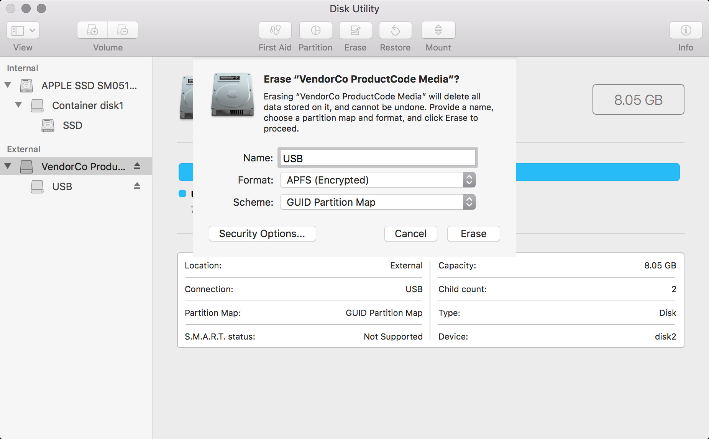

# Tutorial: ssh + scp

By [Dan Phiffer](https://phiffer.org/)

This tutorial offers an introduction to the Swiss army knife of networked computing: `ssh`. We'll start by logging into a remote server, then use `scp` to transfer files. Finally we will generate a public/private key pair that we can use to login to the server more easily and securely.

We're building on skills from the [command line tutorial](01-command-line.md) and we will be assuming that you have a USB thumb drive to store files onto.

## Revision notes

This tutorial has gone through a couple revisions, changing the order of the steps, replacing the server name `organizer.network` with `dsj.organizer.network`, and changing the name of the public key pair to `dsj`.

## Logging into the server

Let's start out by logging into the server using SSH (secure shell). You'll want to replace the `dphiffer` below with your username.

```
$ ssh dphiffer@dsj.organizer.network
dphiffer@dsj.organizer.network's password:
```

Then, type your password in. You should see something like the following:

```
Welcome to Ubuntu 18.04.1 LTS (GNU/Linux 4.15.0-34-generic x86_64)

  System information as of Fri Sep 14 14:33:15 UTC 2018

  System load:  0.0               Processes:           94
  Usage of /:   9.6% of 24.06GB   Users logged in:     0
  Memory usage: 35%               IP address for eth0: 167.99.189.237
  Swap usage:   0%
     _      _
  __| |___ (_)
 / _` / __|| |
| (_| \__ \| |
 \__,_|___// |
         |__/
Welcome to the Data & Social Justice server.

0 packages can be updated.
0 updates are security updates.

Last login: Thu Sep 13 19:52:57 2018 from 8.28.55.30
```

If that didn't work for you, there are a couple things you can double-check:

1. did you specify the right username?
2. are you sure you got the password right?
3. try `ssh -v user@dsj.organizer.network` for verbose output

If it _did_ work, let's try typing in some commands on the remote server:

```
$ who
dphiffer pts/0        2018-09-12 18:36 (129.161.123.176)
```

This shows who else is logged in.

```
$ wall "hello"
```

This will broadcast a message "hello" to everyone else who is logged on. If you are doing this when others are signed in, you will quickly discover that it can be disruptive. You can disable messages by typing:

```
mesg n
```

And you can enable them again with `mesg y`.

This is the UNIX fortune cookie program, it will output something different every time you run it.

```
$ fortune
```

The [cowsay command](https://en.wikipedia.org/wiki/Cowsay) does what it sounds like. (Yes, computer nerds are easily amused.)

```
$ cowsay "moo"
```

Go ahead and logout from your SSH session now that you know it's working.

```
$ exit
logout
Connection to dsj.organizer.network closed.
```

Next we will set up __public keys__ to use with the server. Public keys are kind of like passwords, but they're encoded into a file instead of being something you remember.

## Generate your SSH key pair

Next we will generate an SSH key pair. This is kind of like a password that's stored on your disk as a pair of two files.

* The __public key__ is called a key but it is really more a personal lock that you can send to other people safely.
* The __private key__ is something you keep secret, it is the key to your lock and you should never share it with anyone.

Let's start by opening up the Terminal.

* In the Finder, go to __Applications → Utilities__ and double-click on __Terminal.app__.

Let's make a new folder for your SSH keys, if one does not exist already.

```
$ mkdir -p ~/.ssh
$ cd ~/.ssh
```

Now we can generate our new keys.

```
$ ssh-keygen
```

* You will be asked to provide a __name__, you should enter: `./dsj` (the `./` part means "put this file in the current folder.")
* When prompted for a __password__, just press enter (no password protection).
* Press enter again to confirm you don't want a password.

You should see something like the following:

```
$ ssh-keygen
Generating public/private rsa key pair.
Enter file in which to save the key (/Users/dphiffer/.ssh/id_rsa): ./dsj
Enter passphrase (empty for no passphrase):
Enter same passphrase again:
Your identification has been saved in ./dsj.
Your public key has been saved in ./dsj.pub.
```

The output will also include some extra information about your key's fingerprint.

* Your _private key_ that you should __never share__, is the file `dsj`
* Your _public key_ that is __okay to share__ is the file `dsj.pub`

## Transfer your public key

In order for you to get access to the server we're using in the course, you'll need to upload the _public_ key to the server. We will use `scp` (secure copy) to upload the file.

```
$ scp dsj.pub dphiffer@dsj.organizer.network:~/authorized_keys
dphiffer@dsj.organizer.network's password:
dsj.pub                                 100%  400    11.7KB/s   00:00
```

This will upload your public key to the server in your `~` directory and, in the process, will rename the file to `authorized_keys`. If you see that `100%` part in the response, that indicates that the file transferred successfully.

## Back to SSH

For this next configuration we'll need to log back into the server.

```
$ ssh dphiffer@dsj.organizer.network
```

After you enter your password, create another `.ssh` folder on the remote server:

```
$ mkdir -p ~/.ssh
```

Next, make sure you see the `authorized_keys` file that you uploaded before.

```
$ ls
authorized_keys
```

(Note that if you `ls -a` the `-a` argument will let you see the `.ssh` folder you just created, as well as other hidden files.)

Now we can move the public key file `authorized_keys` into the `.ssh` folder, which will ensure that the SSH software can find it.

```
$ mv authorized_keys .ssh/
```

## Test out the public keys

Now we can try logging in again using the key pair (again, with `dphiffer` replaced with your username).

```
$ ssh -i dsj dphiffer@dsj.organizer.network
```

If everything is working, you should get logged in without having to type your password.

The `-i dsj` part instructs `ssh` to use your private key to login instead of using your password. If the server finds the contents of `dsj.pub` in your `~/.ssh/authorized_keys` file, it will use it to authorize your login.

## SSH configuration

We can make the login process even easier, since that involves a whole lot of typing. Let's add some configuration settings for the server, which we'll nickname `dsj`.

```
$ nano ~/.ssh/config
```

And then add the following (replacing your own username in the process):

```
Host dsj
	User dphiffer
	Hostname dsj.organizer.network
	IdentityFile ~/.ssh/dsj
	ForwardAgent yes
```

Then, to save and quit out of `nano`: type __ctrl-O__ to output and then __ctrl-X__ to exit.

All of this should mean you can login without nearly as much typing:

```
$ ssh dsj
```

If you are able to login without a password, then everything is working, yay! You can log back out.

```
$ exit
```

## Quick upload and download

One of the other side effects is that you can now copy files to the server with a lot less typing.

For example, if you wanted to upload a copy of `don_quixote.txt`, you could use `scp` with the new `dsj` shortcut like this.

```
$ cd ~/Desktop
$ curl http://www.gutenberg.org/cache/epub/996/pg996.txt > don_quixote.txt
$ scp don_quixote.txt dsj:~/
```

The `scp` command uses the pattern: `scp [copy from] [copy to]` and in this case we would be copying a file on our computer called `don_quixote.txt` and uploading it into the `~` home directory on `dsj`. The colon symbol `:` separates the server name `dsj` from the path where we want to upload it. If you just specify a _folder_ and omit the _filename_ from the second half of the `scp` command it just keeps the name of the original file, `don_quixote.txt`.

You could also reverse the order and _download_ a file from the server with `scp`.

```
$ scp dsj:~/don_quixote.txt dq.txt
```

In this case it will download the file `don_quixote.txt` to the current directory, renaming the file `dq.txt` in the process.

## Use a USB thumb drive

This next part is recommended if you're using your own laptop. If you're using the computer lab, then you'll need to store your SSH keys and configuration on your own thumb drive, so keep going!

Insert your USB thumb drive, and then:

* In the Finder, go to __Applications → Utilities__ and double-click on __Disk Utility.app__.
* Select your thumb drive and double-check you have the right one selected, you _really_ don't want to erase the wrong one.
* Click the __Erase__ button.
* Enter a `USB` as the name for your drive.
* Choose __GUID__ as the Scheme. (This may not be necessary.)
* Choose the Format as __Mac OS Extended (Journaled)__.
* Press the __Erase__ button.

A previous version of these steps had you choose __APFS (encrypted)__ Format, but that has proved more trouble than it's worth. If you can get the encrypted filesystem to work, I applaud your operational security! One of the key steps was to choose __View → Show All Devices__ in Dist Utility.app and to choose the "vendor device" that encloses the disk volume.



Now you should have a disk mounted with the name `USB`.

## Move your SSH config files

Open up the Terminal and make an `ssh` folder for your keys and configuration.

```
$ cd /Volumes/USB
$ mkdir ssh
$ cd ssh
```

Now we can move the keys and config file.

```
$ mv ~/.ssh/dsj .
$ mv ~/.ssh/dsj.pub .
$ mv ~/.ssh/config .
```

Next, edit the `config` file:

```
$ nano config
```

You will want to adjust the `IdentityFile` path to use the new USB location.

```
Host dsj
	User dphiffer
	Hostname organizer.network
	IdentityFile /Volumes/USB/ssh/dsj
	ForwardAgent yes
```

Finally, make a new `~/.ssh/config` file that references the one on your USB thumb drive.

```
$ nano ~/.ssh/config
```

Add this one line:

```
Include /Volumes/USB/ssh/config
```

Then save and exit out of nano: __Ctrl-O__ followed by __Ctrl-X__.

You should test out that `ssh dsj` still works, using the new configuration.
