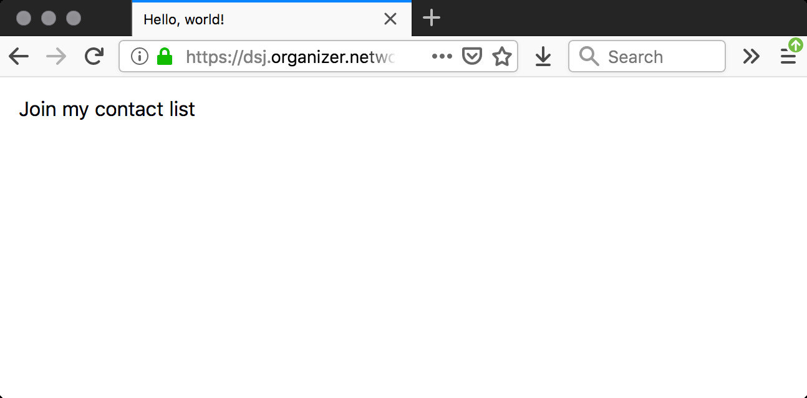

# HTML forms

By [Dan Phiffer](https://phiffer.org/)

This tutorial is about HTML forms, the main way we can gather input from website visitors. This builds on our earlier tutorials, especially the last one on [HTML and CSS](03-html-css.md). In this tutorial we will login to `dsj.organizer.network` and create a simple form submission app.

## Start with a blank page

Recall in the last tutorial that we created a simple [boiler plate web page template](https://github.com/dphiffer/data-and-social-justice/blob/master/tutorials/03-html-css.md#boiler-plate-html) as well as a [blank page folder with some CSS rules](https://github.com/dphiffer/data-and-social-justice/tree/master/tutorials/blank). We will start with that as the basis for our form submission page.

First, login to the server (naturally, replace `username` with your username):

```
$ ssh username@dsj.organizer.network
```

(If your SSH `config` is set up, you could also login with `ssh dsj`.)

Now let's go inside your `public_html` folder and make a new folder `form`.

```
$ cd public_html
$ mkdir form
```

We can easily download the HTML and CSS we will base our page off of.

```
$ cd form
$ blank="https://raw.githubusercontent.com/dphiffer/data-and-social-justice/master/tutorials/blank"
$ curl -O "$blank/index.html"
$ mkdir css
$ cd css
$ curl -O "$blank/css/styles.css"
$ curl -O "$blank/css/reset.css"
$ curl -O "$blank/css/border-box.css"
```

Note that the `$blank` variable is interpreted by the command line shell as the base URL we set in the `blank="..."` command. `curl` is a common way to download files from the Internet.

Now you should be able to load up the blank page at:  
`https://dsj.organizer.network/~username/form/` (with your username in place of `username`)

## The form element

Let's edit the HTML file in `nano`.

```
$ cd ..
$ nano index.html
```

Add the following HTML (note that we aren't showing _all_ of the HTML in the file, just the part we need to edit):

```html
<div id="page">
	<h1>Join my contact list</h1>
	<form action="subscribe.php" method="post">
	</form>
</div>
```

The `<form>` element has two important attributes here: `action="subscribe.php"` controls _where the form will submit its data to_. And the `method="post"` controls what's called the HTTP method. We won't go into too much detail about HTTP methods here, but POST is commonly used for sending data to servers.

Your form doesn't really look like much, but we are off to a good start.



## Input elements

Currently our form doesn't really show anything. Let's add an email input and a submit button.

```
<form action="subscribe.php" method="post">
	<input type="email" name="email">
	<input type="submit" value="Subscribe">
</form>
```
