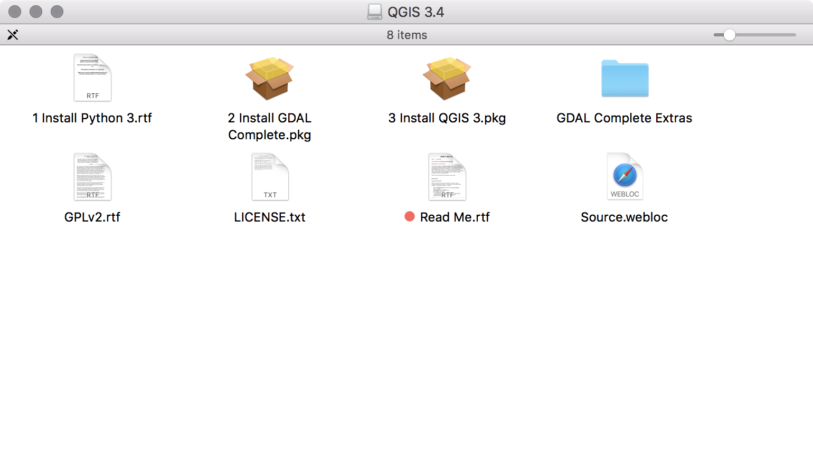

# Tutorial: QGIS + Census TIGER/Line

This is a tutorial for learning how to find and map data from the US Census with QGIS open GIS mapping software.

## 1. Download QGIS

* [Download the newest version of QGIS](https://www.qgis.org/), currently at version 3.4.
* When you unzip the file you will find three different files to open.



* We'll start with __1. Install Python 3.rtf__: double click on it to see the included message.


We will need to verify that the version of `python3` we have installed matches what QGIS wants us to use in the Terminal.

```
$ python3 --version
Python 3.6.5
```

If you see some other version, you may need to go to [python.org](https://www.python.org/downloads/) and install the newest release of version 3.6.x.

* Next, double click on __2. Install GDAL Complete.pkg__ to install [Geospatial Data Abstraction Library](https://www.gdal.org/).

You will see an error message about how the installer hasn't been cryptographically signed. Click okay to close it.


* Go to __Apple Menu → System Preferences__ then click on __Security & Privacy__ then click on __Open Anyway__ and then confirm by pressing __Open__.

* Follow the steps through the installer, clicking __Continue__ and agreeing to the terms of use.

* Repeat the process for __3. Install QGIS 3.pkg__, including the part where you "open it anyway" from the system preferences.

