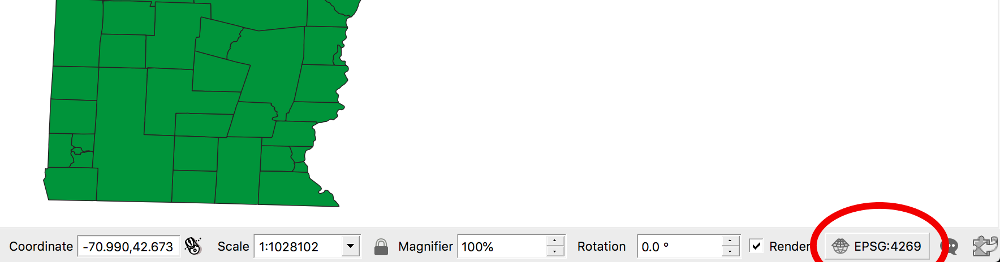

# Tutorial: QGIS + Census TIGER/Line

This is a tutorial for learning how to find and map data from the US Census with QGIS open GIS mapping software.

## 1. Download QGIS

* [Download the newest version of QGIS](https://www.qgis.org/), currently at version 3.4.
* When you unzip the file you will find three different files to open.


* We'll start with __1. Install Python 3.rtf__: double click on it to see the included message.


We will need to verify that the version of `python3` we have installed matches what QGIS wants us to use in the Terminal.

```
$ python3 --version
Python 3.6.5
```

If you see some other version, you may need to go to [python.org](https://www.python.org/downloads/) and install the newest release of version 3.6.x.

* Next, double click on __2. Install GDAL Complete.pkg__ to install [Geospatial Data Abstraction Library](https://www.gdal.org/).

You will see an error message about how the installer hasn't been cryptographically signed. Click okay to close it.


* Go to __Apple Menu → System Preferences__ then click on __Security & Privacy__ then click on __Open Anyway__ and then confirm by pressing __Open__.

* Follow the steps through the installer, clicking __Continue__ and agreeing to the terms of use.

* Repeat the process for __3. Install QGIS 3.pkg__, including the part where you "open it anyway" from the system preferences.

## 2. Download data files

Next we will download the files we need to make a map.

* Go to the [Census TIGER/Line home page](https://www.census.gov/geo/maps-data/data/tiger.html).
* Click on [TIGER/Line shape files](https://www.census.gov/geo/maps-data/data/tiger-line.html).
* From the __2018__ tab click on __Download__ then on __Web Interface__.


The web interface gives us an index of all the different kinds of shapefiles we can download.

* Select __2018__ and __Census Tracts__ and then press __Submit__.


* Next, select __Vermont__ and click __Download__.


* Open the zip file that downloaded, it should be called __tl_2018_50_tract.zip__.


The one we are going to work with is the file called __tl_2018_50_tract.shp__.

## 3. Look at the shapefile

Next we will open up the shapefile and see what we can learn from it.

* Open __QGIS.app__ from your Applications folder.
* Choose __Project → New__ from the menu bar.
* Choose __Layer → Add Layer → Add Vector Layer__


* Click on the "..." button to navigate eto the Vermont shapefile you downloaded.


* Find the file __tl_2018_50_tract.shp__ and click __Open__.


* At the bottom of the window click __Add__ and then __Close__.


Now you should see something that looks like Vermont, but maybe a little more squished than you are used to seeing.


Your version may have different colors (QGIS picks randomly by default), but it will probably look unusually wide compared to what we're accustomed to seeing. The reason for this distortion is the map projection that's being used. We can pick a different projection that works better for the part of the globe we're looking at.

* Click on the projection button on the bottom right part of the window.



* Marvel at the many projection options, they are each designed to minimize distortion for some part of the globe.


* We would be wise to pick a projection that is designed to work well for Vermont.


And now we have someething that looks a little less distorted.


